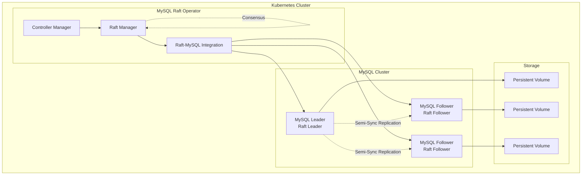
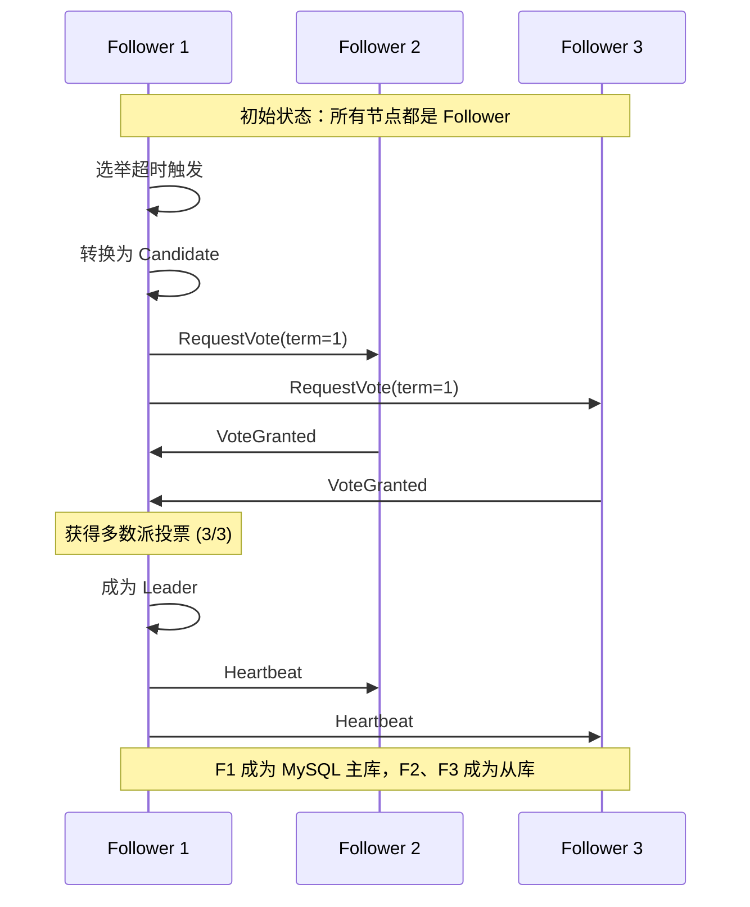

# 🚀 WXDB Raft Operator - 无脑裂最终一致性高可用集群

<div align="center">


**基于 Raft 分布式共识算法的 MySQL 集群解决方案**

*彻底解决脑裂问题 • 自动故障转移 • 数据强一致性*

</div>

---

## ✨ 核心特性

### 🛡️ **无脑裂保证**
- 🎯 **Raft 多数派原则**：确保任何时刻最多只有一个 Leader
- 🔒 **任期机制**：防止旧 Leader 继续服务
- 🌐 **网络分区处理**：自动检测并处理网络分区场景

### ⚡ **智能故障转移**
- 🤖 **自动选举**：基于 Raft 算法的 MySQL 主库自动选举
- 📊 **GTID 快照**：基于数据完整性的最佳候选者选择
- 🔄 **无缝切换**：毫秒级故障检测和恢复

### 🔐 **数据一致性**
- 📝 **Raft 日志复制**：配置变更的强一致性保证
- 🔄 **MySQL 半同步复制**：数据写入的双重确认机制
- ✅ **双重保证**：Raft + MySQL 两层一致性验证

### 📈 **实时监控**
- 📊 **Raft 状态监控**：选举次数、任期、日志索引等
- 🔍 **MySQL 指标**：主从状态、复制延迟、半同步状态
- 🚨 **智能告警**：网络分区、选举失败、复制异常检测

---

## 🏗️ 架构设计



### 🔄 **Raft 选举流程**



---

## 🚀 快速开始

### 📋 **环境要求**

- Kubernetes 1.19+
- Go 1.19+
- Docker
- kubectl

### 🛠️ **部署步骤**

#### 1️⃣ **克隆项目**
```bash
git clone https://github.com/your-repo/mysql-raft-operator.git
cd mysql-raft-operator
```

#### 2️⃣ **构建和部署 Operator**
```bash
# 构建镜像
make docker-build docker-push IMG=your-registry/mysql-operator:raft-v1.0

# 部署到 Kubernetes
make deploy IMG=your-registry/mysql-operator:raft-v1.0
```

#### 3️⃣ **创建 MySQL 集群**
```yaml
# mysql-cluster.yaml
apiVersion: apps.ryansu.com/v1
kind: MysqlCluster
metadata:
  name: mysql-raft-cluster
  namespace: default
spec:
  image: mysql:5.7
  replicas: 3  # 推荐奇数个节点
  masterService: mysql-master
  slaveService: mysql-slave
  storage:
    storageClassName: "standard"
    size: "10Gi"
  resources:
    requests:
      cpu: "500m"
      memory: "1Gi"
    limits:
      cpu: "1000m"
      memory: "2Gi"
```

```bash
kubectl apply -f mysql-cluster.yaml
```

#### 4️⃣ **验证部署**
```bash
# 检查集群状态
kubectl get mysqlcluster mysql-raft-cluster -o wide

# 查看 Pod 状态
kubectl get pods -l app=mysql-cluster

# 检查 Raft 状态
kubectl get mysqlcluster mysql-raft-cluster -o jsonpath='{.status.raftLeader}'
```

---

## 🎭 **脑裂防护演示**

### 🧪 **场景 1：网络分区测试**

```bash
# 模拟网络分区 - 隔离一个节点
kubectl patch pod mysql-raft-cluster-0 -p '{"spec":{"hostNetwork":false}}'

# 观察选举过程
kubectl logs -f deployment/mysql-operator-controller-manager | grep "election"

# 验证只有一个 Leader
kubectl get mysqlcluster -o jsonpath='{range .items[*]}{.metadata.name}: {.status.raftLeader}{"\n"}{end}'
```

### 🧪 **场景 2：主库故障模拟**

```bash
# 删除当前主库 Pod
kubectl delete pod mysql-raft-cluster-0

# 观察自动故障转移
kubectl get mysqlcluster mysql-raft-cluster -w

# 验证新主库选举
kubectl get mysqlcluster mysql-raft-cluster -o jsonpath='{.status.master}'
```

---

## 📊 **监控和运维**

### 📈 **关键指标监控**

```bash
# Raft 集群状态
kubectl get mysqlcluster mysql-raft-cluster -o jsonpath='{.status.raftNodes}' | jq

# 当前 Leader 信息
kubectl get mysqlcluster mysql-raft-cluster -o jsonpath='{.status.raftLeader}'

# MySQL 主从状态
kubectl get mysqlcluster mysql-raft-cluster -o jsonpath='{.status.master}'
kubectl get mysqlcluster mysql-raft-cluster -o jsonpath='{.status.slaves}'
```

### 🔍 **故障排查**

#### **选举失败诊断**
```bash
# 检查网络连通性
kubectl exec -it mysql-raft-cluster-0 -- ping mysql-raft-cluster-1

# 查看选举日志
kubectl logs mysql-operator-controller-manager | grep "election"
```

#### **半同步复制检查**
```bash
# 检查主库半同步状态
kubectl exec -it mysql-raft-cluster-0 -- mysql -uroot -ppassword \
  -e "SHOW STATUS LIKE 'Rpl_semi_sync_master%'"

# 检查从库半同步状态  
kubectl exec -it mysql-raft-cluster-1 -- mysql -uroot -ppassword \
  -e "SHOW STATUS LIKE 'Rpl_semi_sync_slave%'"
```

---

## ⚡ **性能优化**

### 🎛️ **Raft 参数调优**

| 参数 | 推荐值 | 说明 |
|------|--------|------|
| `electionTimeout` | 3-5s | 选举超时时间 |
| `heartbeatInterval` | 300-500ms | 心跳间隔 |
| `logBatchSize` | 100 | 日志批处理大小 |

### 🎛️ **MySQL 半同步调优**

```sql
-- 调整半同步超时
SET GLOBAL rpl_semi_sync_master_timeout = 1000;

-- 调整等待从库数量
SET GLOBAL rpl_semi_sync_master_wait_for_slave_count = 1;
```

### 🎛️ **资源配置建议**

| 组件 | CPU | 内存 | 存储 |
|------|-----|------|------|
| MySQL Pod | 2 核 | 4GB | SSD |
| Operator | 500m | 1GB | - |

---

## 🧪 **测试验证**

### 🔬 **单元测试**
```bash
# 运行 Raft 选举测试
go test ./test -v -run TestRaftElection

# 运行多节点选举测试
go test ./test -v -run TestRaftLeaderElection

# 运行故障转移测试
go test ./test -v -run TestRaftFailover
```

### 🔬 **集成测试**
```bash
# 部署测试集群
kubectl apply -f config/samples/

# 运行完整测试套件
make test-e2e
```

---

## 🏆 **最佳实践**

### 📏 **集群规模**
- ✅ **推荐 3-5 个节点**：平衡可用性和性能
- ✅ **奇数个节点**：避免选举平票
- ✅ **跨可用区部署**：提高容灾能力

### 🔧 **运维建议**
- 📅 **定期备份**：使用 MySQL 备份工具
- 🚨 **监控告警**：配置 Raft 状态告警
- 🔄 **滚动升级**：逐个节点升级，保持多数派在线

### 🛡️ **安全建议**
- 🔐 **网络隔离**：使用 NetworkPolicy 限制访问
- 🔑 **密钥管理**：使用 Kubernetes Secrets
- 📊 **审计日志**：启用 Kubernetes 审计

---

## 🤝 **贡献指南**

我们欢迎社区贡献！请查看 [CONTRIBUTING.md](CONTRIBUTING.md) 了解详细信息。

### 🐛 **报告问题**
- 使用 [GitHub Issues](https://github.com/your-repo/mysql-raft-operator/issues)
- 提供详细的复现步骤和环境信息

### 💡 **功能请求**
- 在 Issues 中描述新功能需求
- 说明使用场景和预期收益

### 🔧 **代码贡献**
1. Fork 项目
2. 创建功能分支
3. 提交代码变更
4. 创建 Pull Request

---

## 📄 **许可证**

本项目采用 [Apache License 2.0](LICENSE) 许可证。

---

## 🙏 **致谢**

- [Raft 算法论文](https://raft.github.io/)
- [Kubernetes Operator SDK](https://sdk.operatorframework.io/)
- [MySQL 官方文档](https://dev.mysql.com/doc/)

---

<div align="center">

**⭐ 如果这个项目对你有帮助，请给我们一个 Star！**

[🐛 报告问题](https://github.com/your-repo/mysql-raft-operator/issues) • 
[💡 功能请求](https://github.com/your-repo/mysql-raft-operator/issues) • 
[📖 文档](https://github.com/your-repo/mysql-raft-operator/wiki)

</div>

